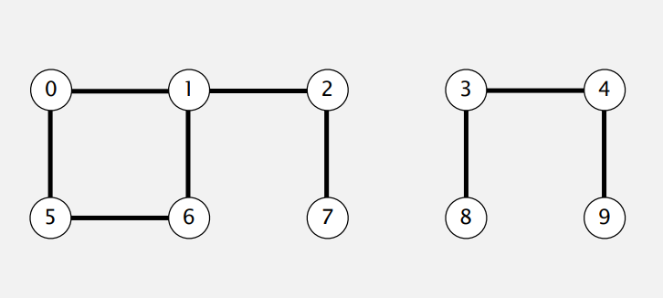

## Union−Find and dynamic connectivity problem

Developing and analyzing algorithms by considering the dynamic connectivity problem. Various implementations of the union-find data type (quick find, quick union, weighted quick union, and weighted quick union with path compression).

### Dynamic connectivity

Given a set on N objects

* Union command: connect two objects
* Find/ connected query: is there a path connecting the two objects

